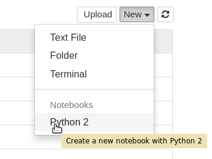

# Scientific Python HATS

**FIXME:** Introduction!

## Getting started

We will use Jupyter to present these tutorials, only because it is a convenient interface to Python. Everything that we will present can be performed the normal way, by editing scripts and running them from the command line. However, a notebook interface lets you interact with the process and retry steps, which is good for learning.

When you log into cmslpc, add a `-L` option to your ssh command:

    ssh -L localhost:8888:localhost:8888 cmslpc-sl6.fnal.gov

On cmslpc, create a CMSSW directory as usual (version 9 and above):

    export SCRAM_ARCH=slc6_amd64_gcc530
    cmsrel CMSSW_9_0_0_pre6
    cd CMSSW_9_0_0_pre6/src
    cmsenv

And now start Jupyter with this command:

    jupyter notebook --no-browser --port=8888 --ip localhost

After a pause (while cmslpc loads the necessary libraries for the first time) you should see a message like the following:

    [I 08:22:45.871 NotebookApp] Serving notebooks from local directory: /uscms_data/d2/pivarski/CMSSW_9_0_0_pre6/src
    [I 08:22:45.871 NotebookApp] 0 active kernels 
    [I 08:22:45.871 NotebookApp] The Jupyter Notebook is running at: http://localhost:8888/?token=XXXXXXXXXXXXXXXXXXXXXXXXXXXXXXXXXXXXXXXXXXXXXXXX
    [I 08:22:45.871 NotebookApp] Use Control-C to stop this server and shut down all kernels (twice to skip confirmation).
    [C 08:22:45.873 NotebookApp] 
        
        Copy/paste this URL into your browser when you connect for the first time,
        to login with a token:
            http://localhost:8888/?token=XXXXXXXXXXXXXXXXXXXXXXXXXXXXXXXXXXXXXXXXXXXXXXXX

Copy/paste the URL it gives you into your web browser and from now on, all interactions with Python and your user account will be through the browser. The `-L` option we passed to ssh is forwarding Jupyter's web traffic through SSH, so your account is safe, even if you access it from home.

Jupyter and all the other Python libraries we will be studying are bundled in CMSSW. For these exercises, there is no need to install anything else.

## First notebook

In your browser, create a new notebook using the menu on the right:

Now you have two tabs: one for finding files and notebooks, one for editing and running code. Try a little Python code: type

    import ROOT

into the first cell and hit shift-enter to evaluate it. (Enter alone lets you write a multi-line cell.)

This notebook is running on cmslpc in your user account. You can also execute shell commands by starting the command with an exclamation point (`!`). Try

    !pwd

to see that you are in your CMSSW directory. (Alternatively, you can start a traditional terminal instead of a notebook from the "New" menu on the directory tab.)

## Getting the tutorials

To download the tutorials, type

    !git clone https://github.com/FNALLPC/scientific-python-hats.git

and hit shift-enter in your notebook. After a few seconds, you should see output like this:

    Cloning into 'scientific-python-hats'...
    remote: Counting objects: 9, done.
    remote: Compressing objects: 100% (7/7), done.
    remote: Total 9 (delta 0), reused 0 (delta 0), pack-reused 0
    Unpacking objects: 100% (9/9), done.

and in your directory tab, there's a new directory called `scientific-python-hats`. All of the tutorials and exercises are in there.

From this point on, follow the instructions in the notebook of your choice.
