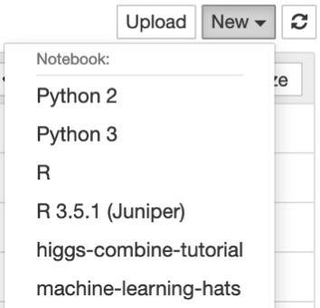

# CMS Machine Learning Hands-on Advanced Tutorial Session (HATS)

## Introduction

This is a set of tutorials for the CMS Machine Learning Hands-on Advanced Tutorial Session (HATS). They are intended to show you how to build machine learning models in python (`Keras`/`TensorFlow`) and use them in your `ROOT`-based analyses. We will build event-level classifiers for differentiating VBF Higgs and standard model background 4 muon events and jet-level classifiers for differentiating boosted W boson jets from QCD jets.

## Main notebooks in this tutorial

 0. [`0-setup-libraries.ipynb`](0-setup-libraries.ipynb): setting up libraries using `CMSSW`
 1. [`1-datasets-uproot.ipynb`](1-datasets-uproot.ipynb): reading/writing datasets from `ROOT` files with `uproot`
 2. [`2-plotting.ipynb`](2-plotting.ipynb): plotting with `pyROOT` and `matplotlib`
 3. [`3-dense.ipynb`](3-dense.ipynb): building, training, and evaluating a fully connected (dense) neural network in `Keras`
 4. [`3.1-dense-pytorch.ipynb`](3.1-dense-pytorch.ipynb): The same as [`3-dense.ipynb`](3-dense.ipynb), but using `PyTorch` rather than `Keras`/`TensorFlow.
 5. [`3.2-dense-bayesian-optimization.ipynb`](3.2-dense-bayesian-optimization.ipynb): The same as [`3-dense.ipynb`](3-dense.ipynb), but using Bayesian optimization of the hyperparameters of the model
 6. [`4-preprocessing.ipynb`](4-preprocessing.ipynb): preprocessing CMS open data to build jet-images (optional)
 7. [`5-conv2d.ipynb`](5-conv2d.ipynb): building, training, and evaluating a 2D convolutional neural network in `Keras`
 8. [`7-vae-mnist.ipynb`](7-vae-mnist.ipynb): building, training, and evaluating a variational autoencoder in `Keras`
 9. [`8-gan-mnist.ipynb`](8-gan-mnist.ipynb): building, training, and evaluating a generative adversarial neural network in `Keras`

## Setup

We will be using the Vanderbilt JupyterHub. Point your browser to:

[https://jupyter.accre.vanderbilt.edu/](https://jupyter.accre.vanderbilt.edu/)

If this is the first time using this JupyterHub, you should see:

<p align="center">
  
</p>

Click the "Sign in with Jupyter ACCRE" button. On the following page, select CERN as your identity provider and click the "Log On" button. Then, enter your CERN credentials or use your CERN grid certificate to autheticate. Click "Spawn" to start a "Default ACCRE Image v5" image with "8 Cores, 8 GB RAM, 1 day timeout."

Now you should see the JupyterHub home directory. Click on "New" then "Terminal" in the top right to launch a new terminal. 

<p align="center">
  
</p>

To download the tutorials, type

```
git clone https://github.com/FNALLPC/machine-learning-hats
```

Now, in your directory tab, there should be a new directory called `machine-learning-hats`. All of the tutorials and exercises are in there. Start by clicking on [`0-setup-libraries.ipynb`](0-setup-libraries.ipynb) and running it. Please note that the first cell may take up to 20 minutes to run.

Now close this notebook by clicking on `File->Close and Halt`. Click the "New" button again. You should see a new kernal called `machine-learning-hats-2020`. If you do not, refresh the page and look again.

<p align="center">
  
</p>

## Notes for working on ACCRE

  1. Please remember to close and halt your notebooks when you're done with them. While it's possible to have multiple notebooks open, this can sometimes cause issues with a lack of memory and kernels becoming unstable. The best procatice is to close the notebooks you aren't using. The notebook symbol will be green while it is in use and gray when it is shutdown.
  2. Remember to shutdown your server when your are done using it. Go to `Control Panel --> Stop My Server` when you are completely finished.

## FAQ

### If someone updates the notebooks after it've clones the repository, how do I get they updates?

In this case you will want to open a terminal, just as you did when you first cloned the repository. Move (`cd`) to the repository directory if not already there. Then do `git pull origin master`. This will pull the latest changes from GitHub. If you've already made edits to a notebook which will be updated, those changes will be conflict. You may want to stash those changes or copy your notebook.

### I want to follow along on the LPC rather than ACCRE.

This is possible, but with a little less user support. You will need to use the following command to open up your ssh connection:
```bash
ssh -L localhost:8888:localhost:8888 <username>@cmslpc-sl7.fnal.gov
```
Replace `<username>` with your LPC username. Then `cd` to the directory of your choice where you will clone the repository as before:
```bash
git clone https://github.com/FNALLPC/machine-learning-hats
```

In order to open Jupyter with all the appopriate libraries, you will need to have either installed a `conda` environment with Jupyter in your `nobackup` area (where you have more space) or have a CMSSW environment setup. To install and activate a `conda` environment you can do:
```bash
wget https://repo.anaconda.com/miniconda/Miniconda3-latest-Linux-x86_64.sh -O $HOME/nobackup/miniconda3.sh
bash $HOME/nobackup/miniconda3.sh -b -f -u -p $HOME/nobackup/miniconda3
source $HOME/nobackup/miniconda3/etc/profile.d/conda.sh
conda env create -f environment.yml --name machine-learning-hats-2020
conda activate machine-learning-hats-2020
```

Once you have a `conda` environment, open Jupyter (which is actually the Jupyter that gets installed as part of the `conda` environment):
```bash
jupyter notebook --no-browser --port=8888 --ip 127.0.0.1
```
If everything worked, the last line of the output should be a url of the form:
```bash
http://127.0.0.1:8888/?token=<long string of numbers and letters>
```
Copy this url into your browser. You may now perform the rest of the exercise like normal, except you will have to change the kernel to the default python3 one (it will have all the necessary libararies because you are using the Jupyter version that is part of your `conda` installation).

In the future, when you need access to Jupyter and want to run this exercise, you can do `source $HOME/nobackup/miniconda3/etc/profile.d/conda.sh; conda activate machine-learning-hats-2020`

## Links

The indico page is: [https://indico.cern.ch/event/917681/](https://indico.cern.ch/event/917681/)

The Mattermost for live support is: [https://mattermost.web.cern.ch/cms-exp/channels/hatslpc-2020](https://mattermost.web.cern.ch/cms-exp/channels/hatslpc-2020)

The datasets we will use are located here: [](https://doi.org/10.5281/zenodo.3901869)

