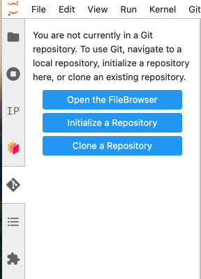
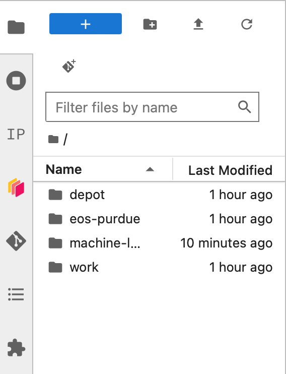

# Purdue Analysis Facility

## 1. Sign-in

See the [Getting Started](https://analysis-facility.physics.purdue.edu/en/latest/doc-getting-started.html) guide and the rest of the documentation for details.

Point your browser to https://cms.geddes.rcac.purdue.edu/hub and log in with your CERN or FNAL account.

Create an instance with the default resources. **Do not select GPUs for the HATS.**

## 2. Clone this repository

1. Once the session starts, open the Git sidebar menu:

2. Click "Clone a Repository". 

3. Copy and paste the repository URL: https://github.com/FNALLPC/machine-learning-hats.git and Clone with the default options.

4. You should now see the `machine-learning-hats` directory in your file browser:

Open it and navigate to `machine-learning-hats` -> `notebooks` 

## 3. Notebooks

Open up a notebook and use the `Python3 kernel (default)` kernel.  You can now the run the notebook by pressing `Shift + Enter`, one cell at a time.

