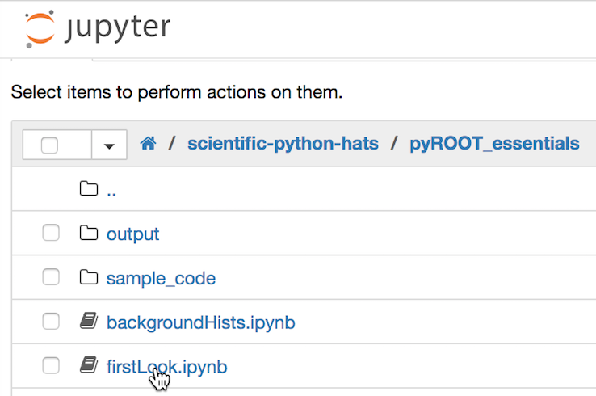

# pyROOT Essentials

This is a tutorial that demonstrates some useful python and pyROOT techniques, focusing on a 'dijet analysis'. Please start out with the notebook [firstLook.ipynb](firstLook.ipynb).

The techniques demonstrated here are intended to be slightly more advanced than simple uses of pyroot for scripting small jobs: we show that pyROOT can be used to efficiently and effectively perform large data analysis tasks. A key lesson of this tutorial is to show that python can be an environment in which c++ classes can be loaded as plugins, so that an analysis workflow can be based in python and pyROOT, faciliting quick development, ease of use, and readability, while modular c++ plugins can be loaded into this environment to handle the CPU-intensive tasks where pyROOT would not be a practical tool.  
